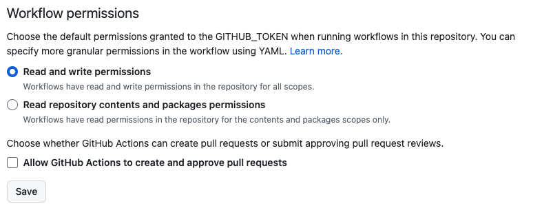
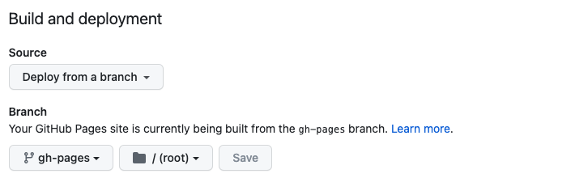

# SETUP
- [ ] Enable read/write for workflows from the Actions > General section of your repo settings on GitHub

- [ ] Enable GitHub Pages in the Pages section of your repo settings, and set `Source` to `Deploy from a branch` and set the branch to `gh-pages`. Annoyingly, this will cause a redundant action to trigger, but it works until the GitHub Actions option comes out of beta

- [ ] Find and replace all instances of `gh-pages-hello-world` with your repo name, and `brookeweil.github.io` with your github.io link
- [ ] Update the default branch name for your repo if necessary, on line 7 of [`.github/workflows/main.yml`](myLib/README.md)
- [ ] Note the `homepage` variable in `package.json`. This is crucial to making your site render on GitHub Pages - make sure not to delete it
- [ ] Delete this `README` section

# gh-pages-hello-world
https://brookeweil.github.io/gh-pages-hello-world/

